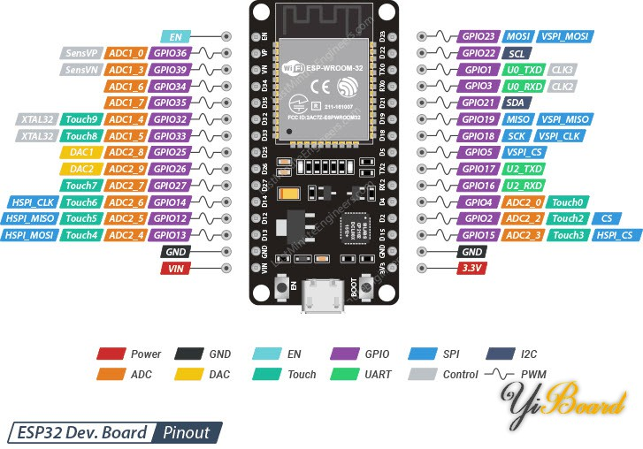
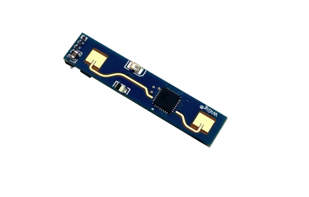

<h1 align="center" >ESP32-简单人体感应开发</h1>

<div align="center">
  <p>
    <strong>本仓库是一个ESP32的开发经验总结</strong><br>

[ESP32学习文档](https://lceda001.feishu.cn/wiki/RpCAw65FsiHfKSkFVV6ckdPjnlf)
  </p>
</div>

## Development environment

- [编辑器: VSCode](https://code.visualstudio.com/)
- [插件: PlatformIO IDE](https://marketplace.visualstudio.com/items?itemName=platformio.platformio-ide)
- 开发板：ESP-wroom-32

     
    see [ESP32学习文档](https://lceda001.feishu.cn/wiki/RpCAw65FsiHfKSkFVV6ckdPjnlf)
- 硬件：HLK-LD2410B人体存在感应模组

     
    see [说明书](/HLK%20LD2410B生命存在感应模组说明书%20V1.07.pdf)


## How to start

1. 安装VSCode和PlatformIO IDE插件。
2. 克隆这个仓库到本机。

```bash
git clone https://github.com/yourusername/yourrepository.git
``` 
3. 打开VSCode，然后打开克隆的项目文件夹。你可以开始编写代码了


## Program structure

```
├─.pio	    	    (组件库)
│  ├─build		(编译生成文件)
│  ├─**libdeps**	    (项目所依赖的所有库文件)
├─.vscode		(vscode配置文件)
├─include		(暂时没有用到：项目需要的头文件)
├─lib			(个人开发的程序库 )
│  ├─mqtt		    (mqtt库)
│  ├─led    		(led库)
│  ├─servo	    	(servo库)
├─src			(源文件目录)

```

## Details

### [1. mqtt库](./lib/mqtt)
> 功能：连接华为云IoTDA平台，上报属性及命令下发。

### [2. radar库](./lib/radar)
> 功能：封装读取毫米波雷达数据。


## 贡献
 如果你想为这个项目做出贡献，欢迎提交Pull Request。
